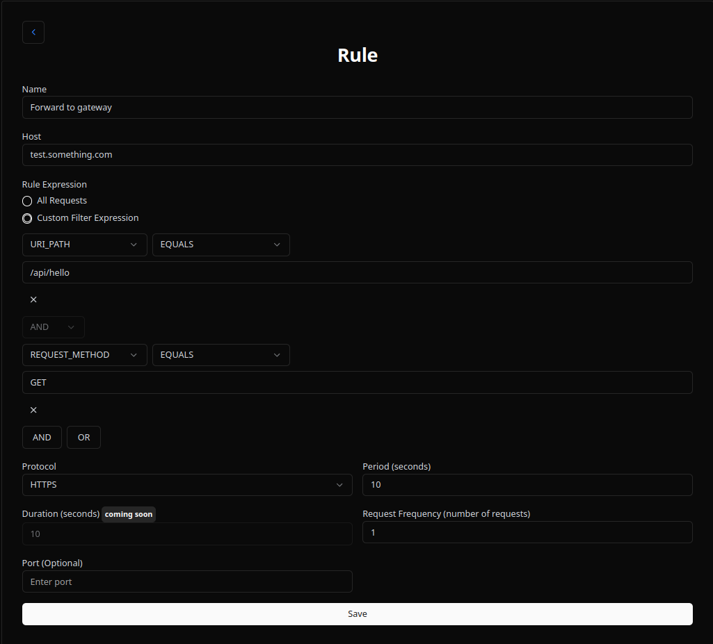

# Welcome to Amplizard Docs

Amplizard is a powerful tool designed to protect your applications from abuse by providing robust rate limiting capabilities. It acts as a gateway, sitting in front of your application and intelligently managing incoming requests.

**Benefits of using Amplizard:**

*   **Rate Limiting:** Protect your servers from being overwhelmed by excessive requests, ensuring availability and stability. Also reduces resource usage on your backend.
*   **Cost-Effective:** Rate limited requests are handled at no charge.
*   **Cheap:** Very cheap to run.
*   **Easy Integration:** Simple to set up and easy to use.

## How to Use Amplizard

Get started with Amplizard in a few easy steps:

1.  **Create a Host:** From [amplizard.com](https://amplizard.com) create a new host.

    

2.  **Copy Host ID:** After creating the host, go back and click on the three dots to reveal a menu, then select "Copy Host ID".

    

3.  **Use Host ID in Header:** When making requests to your application through the Amplizard gateway, include the `X-Host-Id` header with the copied Host ID. This header is essential for routing your traffic through Amplizard and applying the configured rate limiting rules.

    Send your requests to `gateway.amplizard.com`, including the `X-Host-Id` header. The path and query parameters can be anything you need for your application.

    **Example Requests:**

    **Using curl:**

    ```bash
    curl -H "X-Host-Id: YOUR_HOST_ID" https://gateway.amplizard.com/your/application/path?param1=value1&param2=value2
    ```

    **Using fetch in JavaScript:**

    ```javascript
    fetch('https://gateway.amplizard.com/your/application/path?param1=value1&param2=value2', {
      headers: {
        'X-Host-Id': 'YOUR_HOST_ID'
      }
    })
    .then(response => {
      // Handle the response
    });
    ```

    This header tells Amplizard which host configuration to apply to the incoming request, ensuring the correct rate limiting rules are enforced.

    **Rate Limited Response:**

    When a request is rate limited, Amplizard gateway will return a 200 status code with the following JSON body:

    ```json
    {
      "status": "ratelimited",
      "code": 429,
      "message": "Too many requests, slow down."
    }
    ```